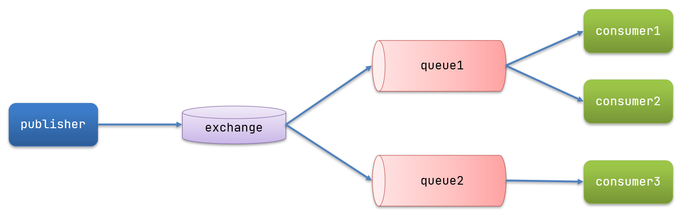

# RabbitMQ


## 一、安装

官网：https://www.rabbitmq.com/

参考：[(111条消息) 【Windows安装RabbitMQ详细教程】_rabbitmq安装教程_慕之寒的博客-CSDN博客](https://blog.csdn.net/tirster/article/details/121938987)

端口：

- 15672

- 5672

## 二、基本介绍

### 1、通信

| 通信     | 示例                                            | 优点                                                 | 缺点                                                         |
| -------- | ----------------------------------------------- | ---------------------------------------------------- | ------------------------------------------------------------ |
| 同步通信 | Feign                                           | 时效性较强，可以立即得到结果                         | 耦合度高<br />性能和吞吐能力下降<br />有额外的资源消耗<br />存在级联失败问题 |
| 异步通信 | RabbitMQ<br />Kafka<br />RocketMQ<br />ActiveMQ | 耦合度低<br />吞吐量提升<br />故障隔离<br />流量削峰 | 依赖于 Blocker 的可靠性、安全性、吞吐能力<br />架构复杂了，业务没有明显的流程线，不好追踪管理 |

### 2、异步调用

> 事件驱动模式

组成：

- 事件发布者（publisher）
- 事件（event）
- 中间人（Bloker）
- 事件订阅者（Consumer）


### 3、MQ

> MQ（MessageQueue）：消息队列，也就是事件驱动架构的 Blocker

|            | RabbitMQ                            | ActiveMQ                                          | RocketMQ   | Kafka           |
| ---------- | ----------------------------------- | ------------------------------------------------- | ---------- | --------------- |
| 公司/社区  | Rabbit                              | Apache                                            | 阿里       | Apache          |
| 开发语言   | Erlang                              | Java                                              | Java       | Scala<br />Java |
| 协议支持   | AMQP<br />XMPP<br />SMTP<br />STOMP | OpenWire<br />STOMP<br />REST<br />XMPP<br />AMQP | 自定义协议 | 自定义协议      |
| 可用性     | **高**                              | 一般                                              | 高         | 高              |
| 单机吞吐量 | 一般                                | 差                                                | 高         | 非常高          |
| 消息延迟   | **微秒级**                          | 毫秒级                                            | 毫秒级     | 毫秒以内        |
| 消息可靠性 | **高**                              | 一般                                              | 高         | 一般            |

- 追求可用性：Kafka、 RocketMQ 、RabbitMQ

- 追求可靠性：RabbitMQ、RocketMQ

- 追求吞吐能力：RocketMQ、Kafka

- 追求消息低延迟：RabbitMQ、Kafka

## 三、RabbitMQ

RabbitMQ中的一些角色：

- publisher：生产者
- consumer：消费者
- exchange个：交换机，负责消息路由
- queue：队列，存储消息
- virtualHost：虚拟主机，隔离不同租户的exchange、queue、消息的隔离

快速入门：[RabbitMQ Tutorials — RabbitMQ](https://www.rabbitmq.com/getstarted.html)

### 1、常见消息模型

- 基本消息队列（BasicQueue）

- 工作消息队列（WorkQueue）

- 发布订阅（Public、Subscribe）

  - Fanout Exchange（广播）

  - Direct Exchange（路由）

  - Topic Exchange（主题）

- RPC

### 2、基本消息队列（BasicQueue）


#### 角色：

- publisher：消息发布者，将消息发送到队列queue
- queue：消息队列，负责接受并缓存消息
- consumer：订阅队列，处理队列中的消息

### 3、工作消息队列（WorkQueue）


### 4、发布订阅（Public、Subscribe）

### 5、Fanout Exchange（广播）


### 6、Direct Exchange（路由）


### 7、Topic Exchange（主题）


### 8、RPC


## 四、基本使用

基本消息队列的消息发送流程：

1. 建立connection

2. 创建channel

3. 利用channel声明队列

4. 利用channel向队列发送消息

基本消息队列的消息接收流程：

1. 建立connection

2. 创建channel

3. 利用channel声明队列

4. 定义consumer的消费行为handleDelivery()

5. 利用channel将消费者与队列绑定

### 1、生产者（publisher）

思路：

- 建立连接
- 创建Channel
- 声明队列
- 发送消息
- 关闭连接和channel

```java
import com.rabbitmq.client.Channel;
import com.rabbitmq.client.Connection;
import com.rabbitmq.client.ConnectionFactory;
import org.junit.Test;

import java.io.IOException;
import java.util.concurrent.TimeoutException;

public class PublisherTest {
    @Test
    public void testSendMessage() throws IOException, TimeoutException {
        // 1.建立连接
        ConnectionFactory factory = new ConnectionFactory();
        // 1.1.设置连接参数，分别是：主机名、端口号、vhost、用户名、密码
        factory.setHost("192.168.150.101");
        factory.setPort(5672);
        factory.setVirtualHost("/");
        factory.setUsername("itcast");
        factory.setPassword("123321");
        // 1.2.建立连接
        Connection connection = factory.newConnection();

        // 2.创建通道Channel
        Channel channel = connection.createChannel();

        // 3.创建队列
        String queueName = "simple.queue";
        channel.queueDeclare(queueName, false, false, false, null);

        // 4.发送消息
        String message = "hello, rabbitmq!";
        channel.basicPublish("", queueName, null, message.getBytes());
        System.out.println("发送消息成功：【" + message + "】");

        // 5.关闭通道和连接
        channel.close();
        connection.close();

    }
}
```

### 2、消费者（consumer）

思路：

- 建立连接
- 创建Channel
- 声明队列
- 订阅消息

```java
import com.rabbitmq.client.*;

import java.io.IOException;
import java.util.concurrent.TimeoutException;

public class ConsumerTest {

    public static void main(String[] args) throws IOException, TimeoutException {
        // 1.建立连接
        ConnectionFactory factory = new ConnectionFactory();
        // 1.1.设置连接参数，分别是：主机名、端口号、vhost、用户名、密码
        factory.setHost("192.168.150.101");
        factory.setPort(5672);
        factory.setVirtualHost("/");
        factory.setUsername("itcast");
        factory.setPassword("123321");
        // 1.2.建立连接
        Connection connection = factory.newConnection();

        // 2.创建通道Channel
        Channel channel = connection.createChannel();

        // 3.创建队列
        String queueName = "simple.queue";
        channel.queueDeclare(queueName, false, false, false, null);

        // 4.订阅消息
        channel.basicConsume(queueName, true, new DefaultConsumer(channel){
            @Override
            public void handleDelivery(String consumerTag, Envelope envelope,
                                       AMQP.BasicProperties properties, byte[] body) throws IOException {
                // 5.处理消息
                String message = new String(body);
                System.out.println("接收到消息：【" + message + "】");
            }
        });
        System.out.println("等待接收消息。。。。");
    }
}
```

## 五、SpringAMQP

### 1、基本介绍

#### AMQP

> Advanced Message Queuing Protocol , 是用于在应用程序之间传递业务消息的开放标准。该协议与语言和平台无关，更符合微服务中独立性的要求。

#### SpringAMQP

> Spring AMQP 是基于 AMQP 协议定义的一套 API 规范，提供了模板来发送和接收消息。包含两部分，其中 spring-amqp 是基础抽象，spring-rabbit 是底层的默认实现。

### 2、基本消息队列（BasicQueue）


#### 引入依赖：

```xml
<!--AMQP依赖，包含RabbitMQ-->
<dependency>
    <groupId>org.springframework.boot</groupId>
    <artifactId>spring-boot-starter-amqp</artifactId>
</dependency>
```

#### 配置文件：

```yaml
spring:
  rabbitmq:
    host: 127.0.0.1 # 主机名
    port: 5672 # 端口
    virtual-host: / # 虚拟主机
    username: guest # 用户名
    password: guest # 密码
```

#### 发送消息：

```java
package org.example.rabbitMq;

import org.junit.Test;
import org.junit.runner.RunWith;
import org.springframework.amqp.rabbit.core.RabbitTemplate;
import org.springframework.beans.factory.annotation.Autowired;
import org.springframework.boot.test.context.SpringBootTest;
import org.springframework.test.context.junit4.SpringRunner;

import java.util.HashMap;
import java.util.Map;

@RunWith(SpringRunner.class)
@SpringBootTest
public class RabbitMQTest {
    @Autowired
    private RabbitTemplate rabbitTemplate;

    @Test
    public void testSendMap() throws InterruptedException {
        // 准备消息
        Map<String,Object> msg = new HashMap<>();
        msg.put("name", "Jack");
        msg.put("age", 21);
        System.out.println("【simple.queue】消息发送");
        // 发送消息
        rabbitTemplate.convertAndSend("simple.queue", msg);
    }
}
```

#### 消息接收：

```java
package org.example.demo.RabbitMQ;

import org.springframework.amqp.core.ExchangeTypes;
import org.springframework.amqp.rabbit.annotation.Exchange;
import org.springframework.amqp.rabbit.annotation.Queue;
import org.springframework.amqp.rabbit.annotation.QueueBinding;
import org.springframework.amqp.rabbit.annotation.RabbitListener;
import org.springframework.stereotype.Component;

import java.util.Map;

@Component
public class SpringRabbitListener {

    @RabbitListener(queues = "simple.queue")
    public void listenWorkQueueMessage3(Map<String,Object> msg) throws InterruptedException {
        System.out.println("【接收端OBJECT】simple.queue："+msg);
    }
}
```

###  3、工作消息队列（WorkQueue）

Work queues，也被称为（Task queues），任务模型。简单来说就是**让多个消费者绑定到一个队列，共同消费队列中的消息**。


#### 消息接收：

> 如果存在多个接送端，会采用轮询方式（默认）接收消息

```java
package org.example.demo.RabbitMQ;

import org.springframework.amqp.rabbit.annotation.RabbitListener;
import org.springframework.stereotype.Component;

@Component
public class SpringRabbitListener {
    @RabbitListener(queues = "simple.queue")
    public void listenWorkQueueMessage1(String msg) throws InterruptedException {
        System.out.println("【接收端】simple.queue(1)："+msg);
    }

    @RabbitListener(queues = "simple.queue")
    public void listenWorkQueueMessage2(String msg) throws InterruptedException {
        System.err.println("【接收端】simple.queue(2)："+msg);
        Thread.sleep(1);
    }
}

```

### 4、能者多劳（WorkQueue）

> 避免采用轮询方式接收消息

```xml
spring:
  rabbitmq:
    listener:
      simple:
        prefetch: 1 # 每次只能获取一条消息，处理完成才能获取下一个消息
```

### 5、发布订阅（Public、Subscribe）

> 发布订阅模式与之前案例的区别就是允许将同一消息发送给多个消费者。实现方式是加入了 **exchange （交换机）**。



#### 交换机的类型

- Fanout：广播
- Direct：路由
- Topic：话题

### 6、发布订阅-Fanout Exchange

思路：

1. 再 consumer 服务中，路由代码声明**队列**、**交换机**，并将两个绑定；
2. 再 consumer 服务中，编写两个消费者方法，分别监听 fanout.queue1 和 fanout.queue2
3. 再 publisher 中编写测试方法，向 xiaozaiz.fanout 中发送消息

#### 6.1 Exchange、Queue、Binging

将队列绑定到交换机中。

```java
package org.example.demo.RabbitMQ.config;

import org.springframework.amqp.core.Binding;
import org.springframework.amqp.core.BindingBuilder;
import org.springframework.amqp.core.FanoutExchange;
import org.springframework.amqp.core.Queue;
import org.springframework.context.annotation.Bean;
import org.springframework.context.annotation.Configuration;

@Configuration
public class FanoutConfig {
    /**
     * 声明交换机
     * @return Fanout类型交换机
     */
    @Bean
    public FanoutExchange fanoutExchange(){
        return new FanoutExchange("xiaozaiz.fanout");
    }

    /**
     * 第1个队列
     */
    @Bean
    public Queue fanoutQueue1(){
        return new Queue("fanout.queue1");
    }

    /**
     * 绑定队列和交换机
     */
    @Bean
    public Binding bindingQueue1(Queue fanoutQueue1, FanoutExchange fanoutExchange){
        return BindingBuilder.bind(fanoutQueue1).to(fanoutExchange);
    }

    /**
     * 第2个队列
     */
    @Bean
    public Queue fanoutQueue2(){
        return new Queue("fanout.queue2");
    }

    /**
     * 绑定队列和交换机
     */
    @Bean
    public Binding bindingQueue2(Queue fanoutQueue2, FanoutExchange fanoutExchange){
        return BindingBuilder.bind(fanoutQueue2).to(fanoutExchange);
    }
}
```

#### 6.2 监听

```java
package org.example.demo.RabbitMQ;

import org.springframework.amqp.rabbit.annotation.RabbitListener;
import org.springframework.stereotype.Component;

@Component
public class SpringRabbitListener {

    @RabbitListener(queues = "fanout.queue1")
    public void listenFanoutQueue1(String msg) {
        System.out.println("消费者1接收到Fanout消息：【" + msg + "】");
    }

    @RabbitListener(queues = "fanout.queue2")
    public void listenFanoutQueue2(String msg) {
        System.out.println("消费者2接收到Fanout消息：【" + msg + "】");
    }
}
```

#### 6.3 发送

```java
package org.example.rabbitMq;

import org.junit.Test;
import org.junit.runner.RunWith;
import org.springframework.amqp.rabbit.core.RabbitTemplate;
import org.springframework.beans.factory.annotation.Autowired;
import org.springframework.boot.test.context.SpringBootTest;
import org.springframework.test.context.junit4.SpringRunner;

@RunWith(SpringRunner.class)
@SpringBootTest
public class RabbitMQTest {
    @Autowired
    private RabbitTemplate rabbitTemplate;

    @Test
    public void testFanoutExchange() {
        // 队列名称
        String exchangeName = "xiaozaiz.fanout";
        // 消息
        String message = "hello, everyone!";
        rabbitTemplate.convertAndSend(exchangeName, "", message);
    }
}
```

### 7、发布订阅-Direct Exchange

Direct Exchange 会将接收到的消息根据规则路由到指定的 Queue ，因此称为路由模式（routes）

- 每一个 Queue 都与 Exchange 设置一个 BindingKey
- 发布者发布消息时，置顶消息的 RoutingKey
- Exchange 将消息路由到 BindingKey 与消息 RoutingKey 一致的队列


 在Direct模型下：

- 队列与交换机的绑定，不能是任意绑定了，而是要指定一个`RoutingKey`（路由key）
- 消息的发送方在 向 Exchange发送消息时，也必须指定消息的 `RoutingKey`。
- Exchange不再把消息交给每一个绑定的队列，而是根据消息的`Routing Key`进行判断，只有队列的`Routingkey`与消息的 `Routing key`完全一致，才会接收到消息

#### 7.1 基于注解声明队列和交换机

> 在 6.1 中使用的是基于配置类的方式声明队列和交换机。
>
> 基于@Bean的方式声明队列和交换机比较麻烦，Spring还提供了基于注解方式来声明。

```java
package org.example.demo.RabbitMQ;

import org.springframework.amqp.core.ExchangeTypes;
import org.springframework.amqp.rabbit.annotation.Exchange;
import org.springframework.amqp.rabbit.annotation.Queue;
import org.springframework.amqp.rabbit.annotation.QueueBinding;
import org.springframework.amqp.rabbit.annotation.RabbitListener;
import org.springframework.stereotype.Component;

@Component
public class SpringRabbitListener {
    
    @RabbitListener(bindings = @QueueBinding(
            value = @Queue(name = "direct.queue1"),
            exchange = @Exchange(name = "xiaozaiz.direct", type = ExchangeTypes.DIRECT),
            key = {"red","blue"}
    ))
    public void listenDirectQueue1(String msg){
        System.out.println("【DIRECT·1】"+msg);
    }

    @RabbitListener(bindings = @QueueBinding(
            value = @Queue(name = "direct.queue2"),
            exchange = @Exchange(name = "xiaozaiz.direct", type = ExchangeTypes.DIRECT),
            key = {"red","white"}
    ))
    public void listenDirectQueue2(String msg){
        System.out.println("【DIRECT·2】"+msg);
    }
}
```

#### 7.2 消息发送

```java
package org.example.rabbitMq;

import org.junit.Test;
import org.junit.runner.RunWith;
import org.springframework.amqp.rabbit.core.RabbitTemplate;
import org.springframework.beans.factory.annotation.Autowired;
import org.springframework.boot.test.context.SpringBootTest;
import org.springframework.test.context.junit4.SpringRunner;

@RunWith(SpringRunner.class)
@SpringBootTest
public class RabbitMQTest {
    @Autowired
    private RabbitTemplate rabbitTemplate;

    @Test
    public void testSendDirectExchange() {
        // 交换机名称
        String exchangeName = "xiaozaiz.direct";
        // 消息
        String message = "红色警报！日本乱排核废水，导致海洋生物变异，惊现哥斯拉！";
        // 发送消息
        // red blue white
        rabbitTemplate.convertAndSend(exchangeName, "red", message+"【red】");
        rabbitTemplate.convertAndSend(exchangeName, "blue", message+"【blue】");
        rabbitTemplate.convertAndSend(exchangeName, "white", message+"【white】");
    }
}
```

### 8、发布订阅-Topic Exchange

`Topic`类型的`Exchange`与`Direct`相比，都是可以根据`RoutingKey`把消息路由到不同的队列。只不过`Topic`类型`Exchange`可以让队列在绑定`Routing key` 的时候使用通配符！

`Routingkey` 一般都是有一个或多个单词组成，多个单词之间以”.”分割，例如： `item.insert`

 通配符规则：

`#`：匹配一个或多个词

`*`：匹配不多不少恰好1个词


解释：

- Queue1：绑定的是`china.#` ，因此凡是以 `china.`开头的`routing key` 都会被匹配到。包括china.news和china.weather
- Queue2：绑定的是`#.news` ，因此凡是以 `.news`结尾的 `routing key` 都会被匹配。包括china.news和japan.news

#### 8.1 代码思路

实现思路如下：

1. 并利用 @RabbitListener 声明Exchange、Queue、RoutingKey

2. 在consumer服务中，编写两个消费者方法，分别监听 topic.queue1 和 topic.queue2

3. 在 publisher 中编写测试方法，向 xiaozaiz. topic 发送消息

#### 8.2 绑定

```java
@RabbitListener(bindings = @QueueBinding(
    value = @Queue(name = "topic.queue1"),
    exchange = @Exchange(name = "xiaozaiz.topic", type = ExchangeTypes.TOPIC),
    key = "china.#"
))
public void listenTopicQueue1(String msg){
    System.out.println("消费者接收到topic.queue1的消息：【" + msg + "】");
}

@RabbitListener(bindings = @QueueBinding(
    value = @Queue(name = "topic.queue2"),
    exchange = @Exchange(name = "xiaozaiz.topic", type = ExchangeTypes.TOPIC),
    key = "#.news"
))
public void listenTopicQueue2(String msg){
    System.out.println("消费者接收到topic.queue2的消息：【" + msg + "】");
}
```

#### 8.3 发送

```java
@Test
public void testSendTopicExchange() {
    // 交换机名称
    String exchangeName = "xiaozaiz.topic";
    // 消息
    String message = "喜报！孙悟空大战哥斯拉，胜!";
    // 发送消息
    rabbitTemplate.convertAndSend(exchangeName, "china.news", message+"【china.news】");
    rabbitTemplate.convertAndSend(exchangeName, "1.news", message+"【1.news】");
    rabbitTemplate.convertAndSend(exchangeName, "china.1", message+"【china.1】");
}
```

### 9、消息转换器

之前说过，Spring会把你发送的消息序列化为字节发送给MQ，接收消息的时候，还会把字节反序列化为Java对象。

只不过，默认情况下Spring采用的序列化方式是JDK序列化。众所周知，JDK序列化存在下列问题：

- 数据体积过大
- 有安全漏洞
- 可读性差

我们来测试一下。

#### 9.1 测试默认转换器

```java
@Test
public void testSendMap() throws InterruptedException {
    // 准备消息
    Map<String,Object> msg = new HashMap<>();
    msg.put("name", "Jack");
    msg.put("age", 21);
    // 发送消息
    rabbitTemplate.convertAndSend("simple.queue","", msg);
}
```

```java
    @RabbitListener(queues = "simpleObject.queue")
    public void listenWorkQueueMessage1(Object msg) throws InterruptedException {
        System.out.println("【接收端】simple.queue(1)："+msg);
    }
```

#### 9.2 配置JSON转换器

引入依赖：

```xml
<dependency>
    <groupId>com.fasterxml.jackson.dataformat</groupId>
    <artifactId>jackson-dataformat-xml</artifactId>
    <version>2.9.10</version>
</dependency>
```

配置消息转换器。

在启动类中添加一个Bean即可：

```java
package org.example.demo.RabbitMQ.config;

import org.springframework.amqp.support.converter.Jackson2JsonMessageConverter;
import org.springframework.amqp.support.converter.MessageConverter;
import org.springframework.context.annotation.Bean;
import org.springframework.context.annotation.Configuration;

@Configuration
public class FanoutConfig {

    @Bean
    public MessageConverter jsonMessageConverter(){
        return new Jackson2JsonMessageConverter();
    }
}
```

#### 9.3 监听

```java
    @RabbitListener(queues = "object.queue")
    public void listenWorkQueueMessage3(Map<String,Object> msg) throws InterruptedException {
        System.out.println("【接收端】simple.queue(1)："+msg);
    }
```

