## 学习项目演示

[TOC]

## 一、独立模块

### 1、介绍

这是一个基于 SpringBoot 开发的独立模块项目，实现了登录验证、分片上传、数据缓存、限时优惠卷抢购、ES搜索。

技术：Spring boot + Mybatis plus + MySQL + Redis + ElasticSearch + RabbitMQ 

地址：https://nav.xiaozaiz.xyz/K/demo/index.html

实现：

1. 使用 Redis 实现登录验证，通过UUID值为key将用户信息保存到 redis 中，可实现分布式系统用户登录验证。
2. 通过 md5 给文件基本信息进行编码实现秒传，将文件进行 base64 编码拆分进行分片，实现分片上传。
3. 通过 redis 缓存数据，提高查询效率，减低 Mysql 数据库的负担。
4. 通过使用版本号法、redis 及 Redisson 实现限时优惠卷抢购，解决超卖问题及实现了一人一单。
5. 集成 ElasticSearch 实现了数据搜索、过滤、排序、数据聚合、自动补全等功能，提高了系统的数据检索效率。
6. 使用 RabbitMQ 实现了数据的异步处理和消息队列的管理，进一步提高了系统的吞吐量，同时也减低了代码之间的耦合度。

### 2、效果

#### （1）登录

1. 通过手机号发送验证码；
2. 发起登录请求，检查手机号及验证码是否正确；
3. 如果手机号及验证码正确，就通过UUID生成的随机token；
4. 以token为key，用户信息为value，将用户信息保存到 reids 中，并将token返回；
5. 前端将token保存，每次发起请求的同时携带token。

#### （2）验证

1. 检查检查请求中是否携带 token；
2. 检查redis是否存在token对应的用户信息；
3. 如果redis存在用户信息，即用户已经登录，则将用户信息保存到ThreadLocal中，并放行；
4. 用户请求结束后，移除 ThreadLocal 中的用户信息。

**登录前：返回未登录信息，要求登录**：

**登录后：成功响应结果**：

#### （3）文件

1. 通过文件名称、文件类型及文件大小生成md5码，用于实现秒传；
2. 先通过md5检验文件是否已经存在；
3. 如果文件没有存在，则开始使用base64对文件进行分片进行上传；
4. 后端对文件的base64进行合并，并根据总分片大小及当前分片决定是否继续。

**文件分片上传**：

**文件秒传：文件已经存在**：

#### （4）优惠卷

1. 通过redis存储优惠卷信息及用户购买信息；
2. 用户发起抢优惠卷的请求；
3. 检查优惠卷数量是否充足及用户是否已经下单，使用lua脚本保证操作的原子性；
4. 如果优惠卷数量充足，且用户没有下单，则以Redis全局唯一ID作为优惠卷订单号，将优惠卷订单信息保存到redis中；
5. 开启异步阻塞队列，实现将优惠卷订单信息保存到mysql数据库中，同时返回抢购结果，实现快速响应。

**优惠卷数量充足且用户没有下单**：

**用户重复下单**：

**优惠卷数量不足**：

#### （5）缓存

1. 通过设置空值的方式解决缓存穿透问题；
2. 通过使用逻辑过期解决缓存击穿的问题；

**缓存中不存在数据**：

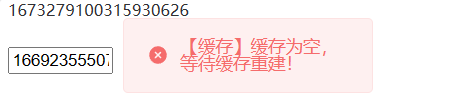

**缓存中存在数据，但是已经过期**：

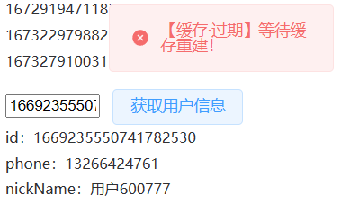

**缓存未过期**：

**缓存及数据库中都不存在数据**：

#### （6）ES搜索

使用 ElasticSearch 进行搜索，实现数据搜索、过滤、排序、数据聚合、自动补全等功能，提高了系统的数据检索效率。

**完整页面展示**：

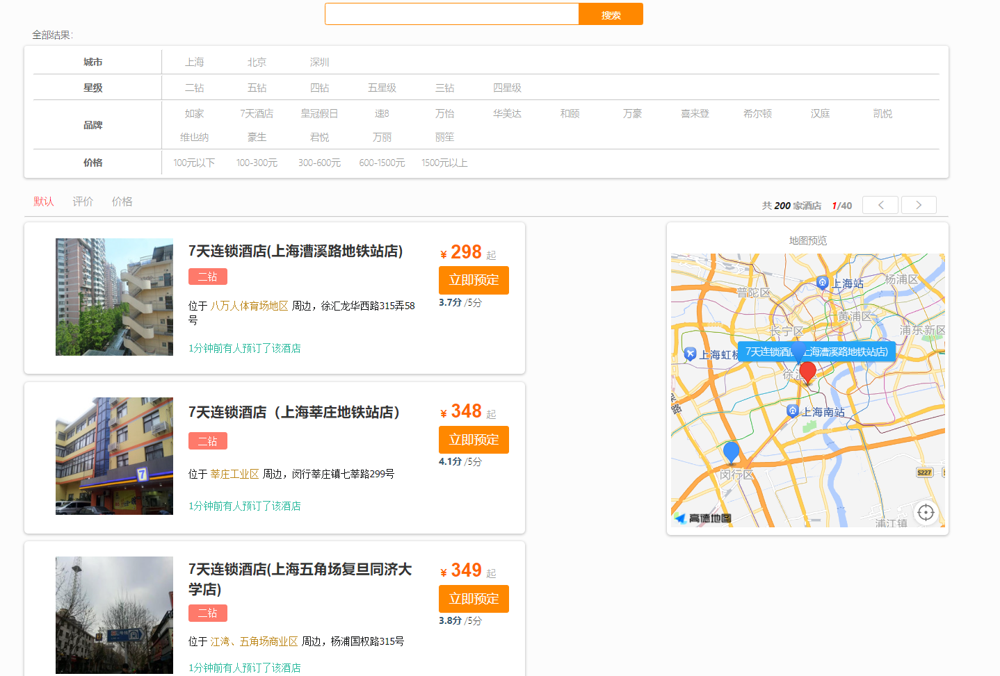

**数据聚合**：

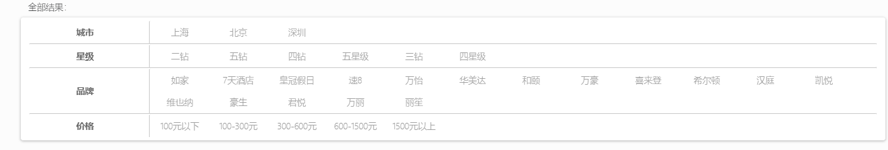

**自动补全**：

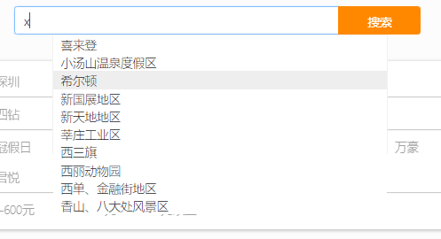

**搜索**：

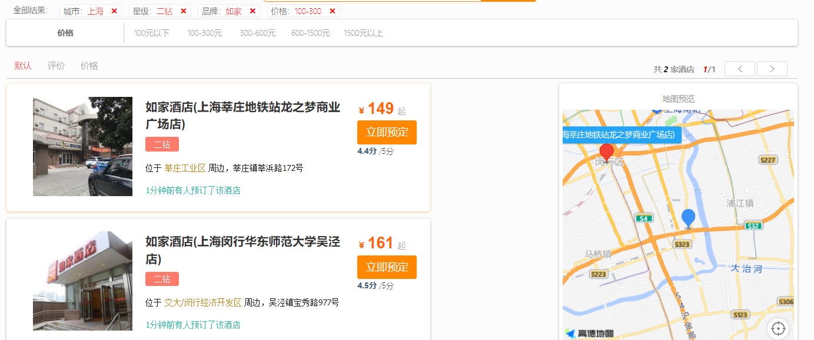

## 二、SQL筛选器

### 1、介绍

这是一个 SQL 过滤筛选器，用于查询和过滤数据库中的数据，并将筛选后的数据保存为 Excel 文件。

技术：Vue + Element + Spring boot + Mybatis plus + MySQL

项目地址：https://github.com/misxzaiz/Adventure

实现：

1. 使用 Vue 和 Element 编写前端页面

2. 使用 Spring boot 和 Mybatis plus 实现后端业务逻辑

3. 使用 MySQL 数据库进行数据管理

4. 使用 [hutool工具包](https://www.hutool.cn/) 进行参数校验

5. 使用 lombok 插件替换 get、set 方法

6. 使用 [QueryBuilder](https://querybuilder.js.org/) 构建 SQL 过滤筛选器

### 2、效果

#### （1）添加筛选规则

其中可以添加规则、组以及设置规则和组之间的关系，包含NOT、和及或。

#### （2）功能按键

依次为重置筛选规则、根据筛选规则进行查询和将查询结果保存为Excel文件。

#### （3）SQL查询语句

这是添加筛选规则后得到的SQL查询语句，用于进行数据库查询。

#### （4）查询结果

根据筛选规则查询到的结果。

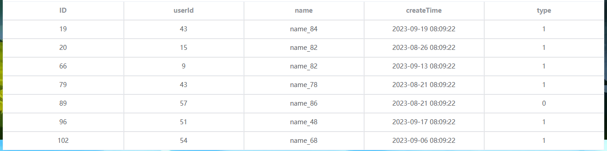

## 三、课程管理系统

### 1、介绍

本项目是基于微服务架构构建的课程后台管理系统和前台展示页面。

技术：Eureka + Gateway + Redis + MySQL + SpringBoot + MyBatis

项目地址：https://gitee.com/shanhais/join-test-two

实现：

1. 文件上传：使用分片上传方式优化了上传速度，并降低了内存的使用。这个功能的实现可以有效地提高用户的体验，降低由于文件过大导致的内存溢出等问题；
2. 增删改查：使用 Mybatis 实现了增删改操作，同时还实现了分页查询等操作。这些常见的 CRUD 功能是任何一个管理系统的重要组成部分；
3. 认证和鉴权：该功能基于 Redis 和随机生成的 token 实现用户登录功能，保证了系统的安全性和完整性。通过使用 Redis 作为存储介质，可以更好地保护用户信息。

### 2、效果

### （1）课程分类管理

功能：添加课程分类，有一级分类和二级分类

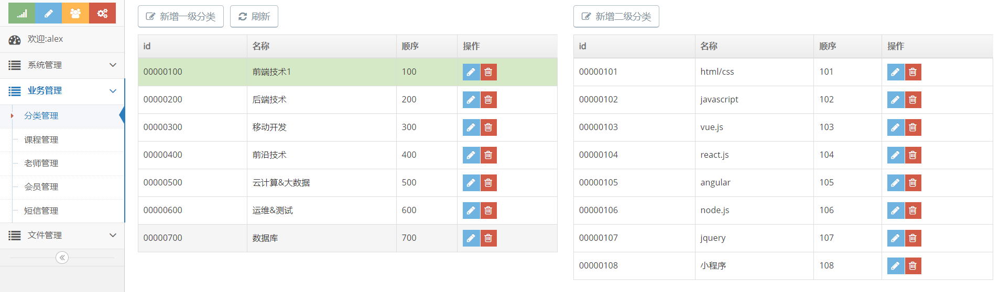

### （2）课程管理

添加课程：这里可以添加课程相关信息，并可以选择对应的课程分类和教师以及上传课程封面

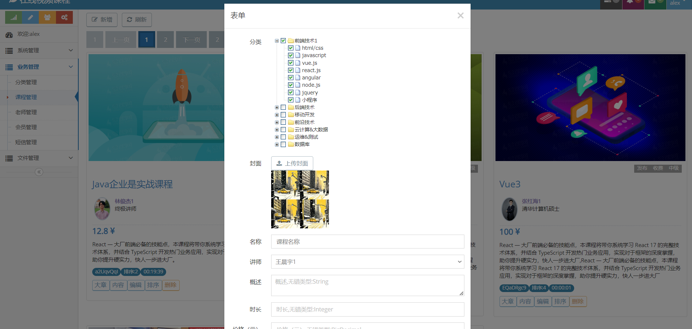

课程展示：这里使用分页的形式展示课程信息，提高用户体验，加快页面加载速度。

课程章节管理：这里可以管理课程的章节

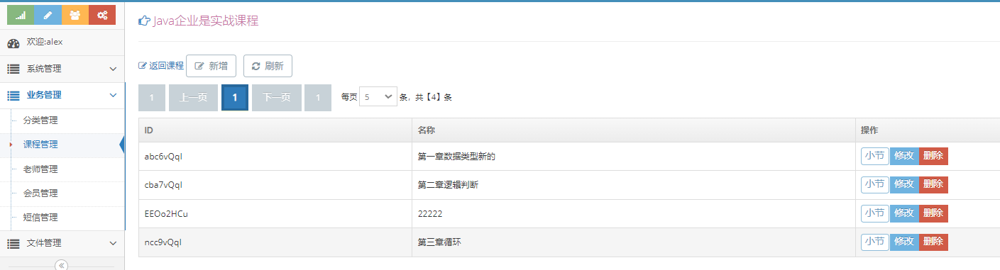

课程章节内容管理：这里可以管理章节对应的内容

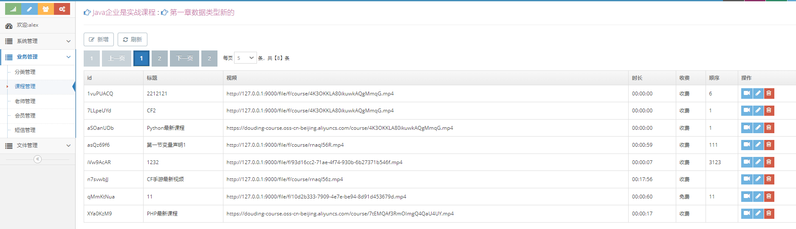

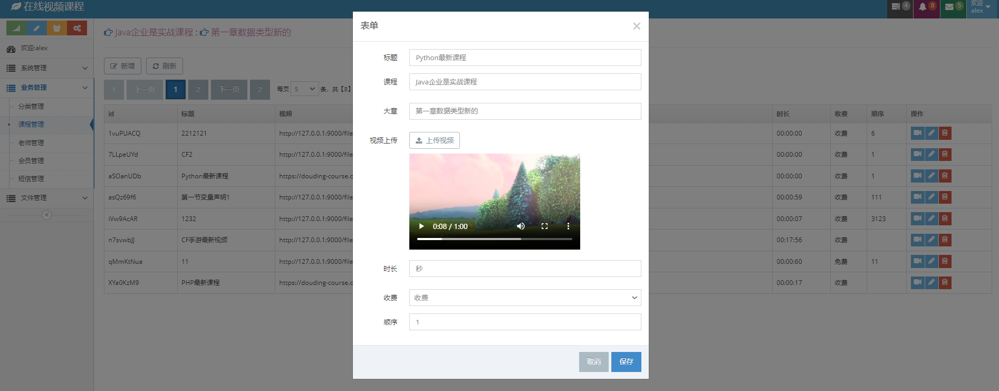

### （3）教师管理：

教师管理：

### （4）筛选课程：

这是用户使用的页面，用于筛选课程。

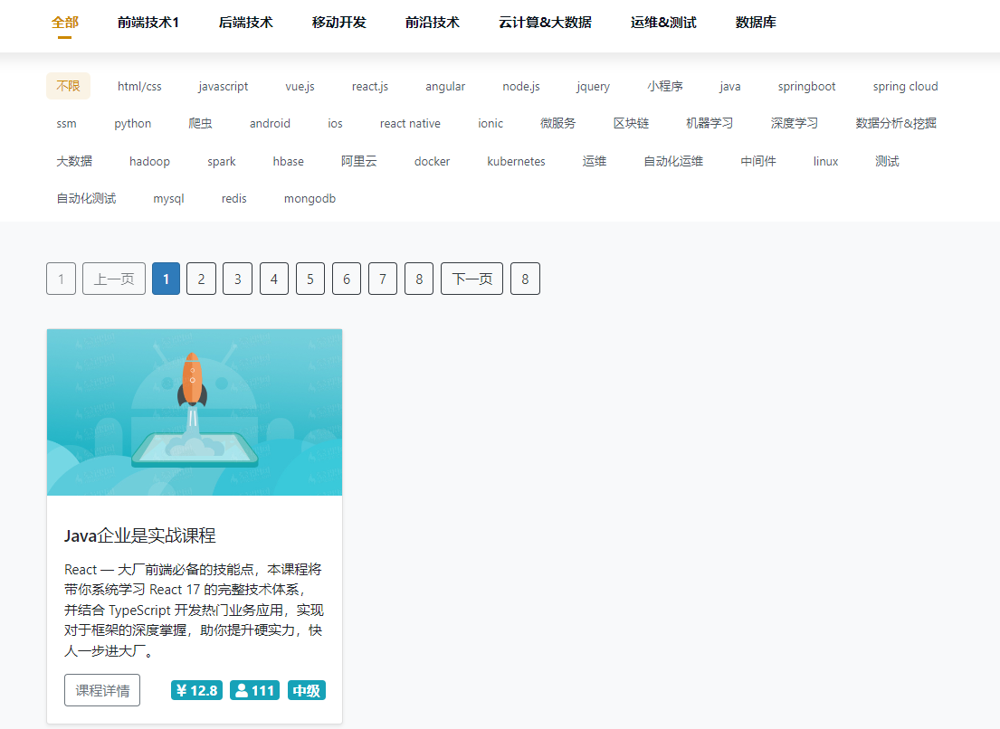

### （5）课程详情：

这是课程详情页面。

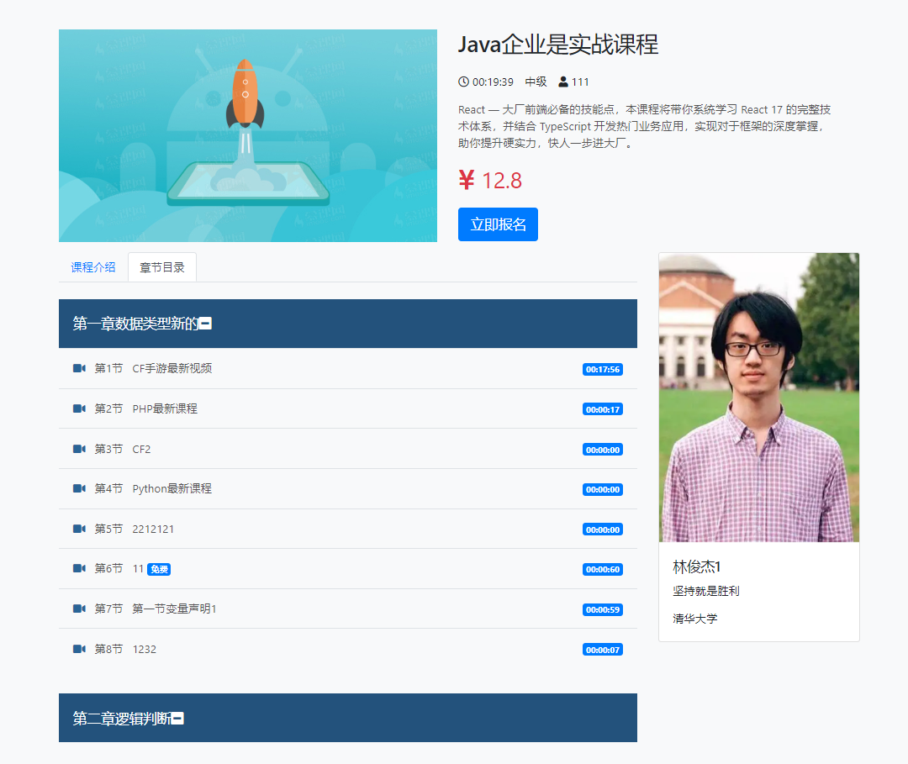

### （6）学习课程：

这是课程对应的学习资料。

## 四、外卖

### 1、介绍

这是一个基于 SpringBoot 和微信小程序开发的外卖小程序项目，实现了登录注册、下单、评价、用户信息管理等功能。

技术：微信小程序 + Spring boot + Mybatis plus + MySQL + Minio

项目地址：https://gitee.com/shanhais/take-out

实现：

1. 使用微信小程序编写前端页面

2. 使用 Spring boot 和 Mybatis plus 实现后端业务逻辑

3. 使用 MySQL 数据库进行数据管理

4. 使用 Minio 存储用户头像、菜品图片及用户评论

### 2、效果

#### （1）首页

在首页包含店铺的基本展示及选择点餐形式，包含外卖到家或者到店自取。

#### （2）菜单页

用户可以在此选择菜品或者是查看店铺的评论。

#### （3）购物车页

用户可以在此进行下单。

#### （4）用户页

用户可以在此进行注册登录、编辑用户信息、查看订单信息、添加评论等。

