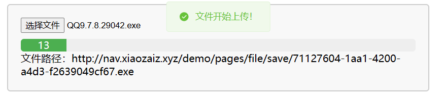
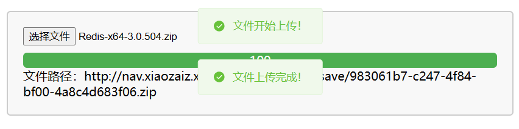
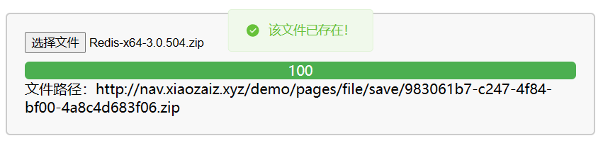

# 文件（分片）

## 问题

1. 当上传的文件约超过100MB后，可能会存在“(另一个程序正在使用此文件，进程无法访问。)”这个问题。

解决：使用`Thread.sleep(100)`休眠之后重试

2. 安装包（如exe等）在使用文件上传后无法正常安装。

解决：限制上传文件类型，当安装包（如exe等）被压缩为zip时，在上传完成后，在解压之后就可以正常安装了。

3. Redis 连接被强制断开（远程主机强迫关闭了一个现有的连接。）

## 效果展示

### 上传新文件



### 文件上传完成



### 文件重复上传



## 一、文件信息

| 属性名         | 数据类型     | 说明                    |
| -------------- | ------------ | ----------------------- |
| id             | bigint       | 主键                    |
| path           | varchar(100) | 相对路径                |
| name           | varchar(100) | 文件名                  |
| primitive_name | varchar(100) | 文件原名                |
| suffix         | varchar(10)  | 后缀                    |
| size           | int          | 大小（单位：字节B）     |
| use            | char         | 用途                    |
| create_time    | timestamp    | 创建时间                |
| update_time    | timestamp    | 更新时间                |
| shard_index    | int          | 已上传分片              |
| shard_size     | int          | 分片大小（单位：字节B） |
| shard_total    | int          | 分片总数                |
| key            | varchar(32)  | 文件标识                |

### 数据表

```sql
CREATE TABLE `tb_file` (
  `id` bigint(20) UNSIGNED NOT NULL AUTO_INCREMENT COMMENT '主键',
  `path` varchar(100) NOT NULL COMMENT '相对路径',
  `name` varchar(100) DEFAULT NULL COMMENT '文件名',
  `primitive_name` varchar(100) DEFAULT NULL COMMENT '文件原名',
  `suffix` varchar(10) DEFAULT NULL COMMENT '后缀',
  `size` bigint(20) DEFAULT NULL COMMENT '大小|字节B',
  `file_use` char(1) DEFAULT NULL COMMENT '用途',
  `create_time` timestamp NOT NULL DEFAULT CURRENT_TIMESTAMP COMMENT '创建时间',
  `update_time` timestamp NOT NULL DEFAULT CURRENT_TIMESTAMP ON UPDATE CURRENT_TIMESTAMP COMMENT '更新时间',
  `shard_index` int(11) DEFAULT NULL COMMENT '已上传分片',
  `shard_size` int(11) DEFAULT NULL COMMENT '分片大小|B',
  `shard_total` int(11) DEFAULT NULL COMMENT '分片总数',
  `md5_key` varchar(32) DEFAULT NULL COMMENT '文件标识',
  PRIMARY KEY (`id`),
  UNIQUE KEY `path_unique` (`path`),
  UNIQUE KEY `key_unique` (`md5_key`)
) ENGINE=InnoDB DEFAULT CHARSET=utf8mb4 COMMENT='文件';
```

### File 实体类

```java
import com.baomidou.mybatisplus.annotation.TableName;
import com.fasterxml.jackson.annotation.JsonFormat;
import lombok.Data;

import java.util.Date;

@Data
@TableName("tb_file")
public class File {
    private Long id;
    private String path;
    private String name;
    private String primitiveName;
    private String suffix;
    private Long size;
    private Character fileUse;
    @JsonFormat(pattern="yyyy-MM-dd HH:mm:ss",timezone = "GMT+8")
    private Date createTime;
    @JsonFormat(pattern="yyyy-MM-dd HH:mm:ss",timezone = "GMT+8")
    private Date updateTime;
    private Integer shardIndex;
    private Integer shardSize;
    private Integer shardTotal;
    private String md5Key;
}
```

### FileDto 封装类

```java
import com.fasterxml.jackson.annotation.JsonFormat;
import lombok.Data;

import java.util.Date;

@Data
public class FileDto {

    private Long id;
    private String path;
    private String name;
    private String primitiveName;
    private String suffix;
    private Long size;
    private String fileUse;
    private Integer shardIndex;
    //   base64 字符串
    private String  shard;
    private Integer shardSize;
    private Integer shardTotal;
    private String md5Key;
    @JsonFormat(pattern="yyyy-MM-dd HH:mm:ss",timezone = "GMT+8")
    private Date createTime;
    @JsonFormat(pattern="yyyy-MM-dd HH:mm:ss",timezone = "GMT+8")
    private Date updateTime;

}
```


## 二、任务

1. 获取文件标识符md5
2. 检查文件标识符，判断文件是否存在，实现妙传；
3. 文件分片上传

## 三、获取文件标识符md5

```java
    @PostMapping("/md5")
    public Result getFileMd5(@RequestBody Map<String, Object> params) {
        String fileForm = (String)params.get("fileForm");
        log.info("【获取MD5】{}",fileForm);
        String md5 = SecureUtil.md5(fileForm);
        return Result.ok(md5,"获取md5成功！");
    }
```

- SecureUtil：cn.hutool 的工具类

## 四、检查文件标识符

```java
    /**
     * 根据前端生成的MD5标识查询文件
     */
    @GetMapping("/check/{md5Key}")
    public Result check(@PathVariable String md5Key) throws Exception {
        log.info("【文件上传】检查上传分片开始：{}", md5Key);
        FileDto fileDto = fileService.findByKey(md5Key);
        if (fileDto == null) {
            return Result.fail("不存在该文件！");
        }
        return Result.ok(fileDto,"该文件已存在！");
    }
```

```java
    private File selectByKey(String md5Key){
        return query().eq("md5_key", md5Key).one();
    }

    @Override
    public FileDto findByKey(String md5Key) {
        File file = selectByKey(md5Key);
        if (file == null) {
            return null;
        }
        return BeanUtil.copyProperties(file,FileDto.class);
    }
```


## 五、分片上传


```java
    /**
     * 分片上传
     */
    @PostMapping("/upload")
    public Result upload(@RequestBody FileDto fileDto) throws Exception {
        log.info("【分片上传】fileDto:{}",fileDto.getName());
        try {
            // 处理上传文件的逻辑...
            return fileService.uploadFile(fileDto);
        } catch (Exception e) {
            log.error("文件上传失败！", e);
            Thread.sleep(100);
            // 重试
            return fileService.uploadFile(fileDto);
            // return Result.fail("文件上传失败：" + e.getMessage());
        }
    }
```

```java
@Slf4j
@Service
public class FileServiceImpl extends ServiceImpl<FileMapper, File> implements FileService {

    @Value("${file.path}")
    private String FILE_PATH;

    @Value("${file.domain}")
    private String FILE_DOMAIN;

    @Override
    public void saveFile(FileDto fileDto) {
        File file = BeanUtil.copyProperties(fileDto,File.class);
        // 根据key值去数据库查询File
        File fileDb = selectByKey(fileDto.getMd5Key());
        // 判断是新增 还是修改
        if (fileDb == null) {
            save(file);
        } else {
            // 如果是更新的话 先更改文件的ShardIndex属性 在update
            fileDb.setShardIndex(fileDto.getShardIndex());
            updateById(file);
        }
    }

    private File selectByKey(String md5Key){
        return query().eq("md5_key", md5Key).one();
    }

    @Override
    public FileDto findByKey(String md5Key) {
        File file = selectByKey(md5Key);
        if (file == null) {
            return null;
        }
        return BeanUtil.copyProperties(file,FileDto.class);
    }

    @Override
    @Transactional
    public Result uploadFile(FileDto fileDto) throws Exception {
        // 检查数据库中是否存在该文件的信息
        FileDto fileDtoDatabase = findByKey(fileDto.getMd5Key());
        String fileName = null;
        // 数据库中不存在文件信息
        if (fileDtoDatabase == null) {
            // 生成随机存储文件名
            fileName = UUID.randomUUID().toString() + "." + fileDto.getSuffix();
            fileDto.setPrimitiveName(fileDto.getName());
            fileDto.setName(fileName);
            fileDto.setPath(FILE_DOMAIN + fileName);
            File file = BeanUtil.copyProperties(fileDto, File.class);
            save(file);
            Long fileId = file.getId(); // 获取回传id
            fileDto.setId(fileId);
        }

        // 检查分片
        Integer index = fileDto.getShardIndex();
        if (fileDto.getShardTotal() >= index) {
            saveFile(fileDto);
            fileDto.setShardIndex(++index);
            merge(fileDto);
        }

        return Result.ok(fileDto, "文件上传！");
    }

    // 合并分片
    private void merge(FileDto fileDto) throws Exception {
        log.info("合并分片开始");
        // 文件存储的位置
        String fileUploadPath = FILE_PATH;
        // 文件名
        String fileName = fileDto.getName();
        // 文件二进制，包含前缀 data:application/octet-stream;base64,
        String shard = fileDto.getShard();

        // 将二进制数据解码为字节数组
        byte[] content = Base64.getDecoder().decode(shard.split(",")[1]);

        // 将分片写入本地磁盘
        // 创建文件夹
        java.io.File file = new java.io.File(fileUploadPath, fileName);
        if (!file.getParentFile().exists()) {
            boolean success = file.getParentFile().mkdirs(); // 创建目录和文件
            if (!success) {
                throw new RuntimeException("Failed to create directory: " + file.getAbsolutePath());
            }
        }

        // 使用 try-with-resources 语句，确保 FileOutputStream 对象自动关闭
        try (FileOutputStream fos = new FileOutputStream(file, true)) {
            fos.write(content);
            fos.flush();
        }
    }
}
```


## 六、前端页面

```html
<!DOCTYPE html>
<html lang="en">
<head>
    <meta charset="UTF-8">
    <meta name="viewport" content="width=device-width, initial-scale=1.0">
    <title>Document</title>

    <link rel="stylesheet" href="../../css/element.css" />
    <script src="../../js/vue@3.js"></script>
    <script src="../../js/element-plus.js"></script>
    <script src="../../js/axios.min.js"></script>
    <script src="../../index.js"></script>
    <style>
        #app {
          margin: 20px;
          padding: 20px;
          border: 2px solid #ccc;
          border-radius: 5px;
          background-color: #f8f8f8;
        }
        
        input[type="file"] {
          margin-bottom: 10px;
        }
        
        .progress-bar {
          width: 100%;
          height: 20px;
          background-color: #eee;
          border-radius: 5px;
          overflow: hidden;
        }
        
        .progress {
          height: 100%;
          background-color: #4CAF50;
          text-align: center;
          line-height: 20px;
          color: #fff;
          transition: width 0.3s ease-in-out;
        }
        </style>
</head>
<body>
    
    <div id="app">
        <div>
            <input type="file" ref="file" v-on:change="uploadFile()">
            <div class="progress-bar">
              <div class="progress" :style="{width: uploadSpeed + '%'}">{{uploadSpeed}}</div>
            </div>
            <div>文件路径：{{imageUrl}}</div>
        </div>
    </div>

    <script>

        const App = {
            data() {
                return {
                    uploadSpeed: 0,
                    imageUrl: ''
                }
            },
            methods: {
                uploadFile(){
                    let that = this;
                    let formData = new window.FormData();
                    let file = that.$refs.file.files[0]; //找到ref别名
                    // 获取文件的md5，使用file.name+file.size+file.type
                    axios.post("/file/md5",{fileForm: file.name+file.size+file.type})
                        .then(res => {
                            let key = res.data.data
                            let fileName = file.name; // 文件名
                            let suffix = fileName.substring(fileName.lastIndexOf(".")+1,fileName.length).toLowerCase();
                            //文件分片
                            let shardSize = 5 * 1024 * 1024; //一个分片5MB大小
                            let shardIndex = 1; //分片索引 1标识第一个分片 不要从0开始
                            let size = file.size; 
                            let shardTotal = Math.ceil(size / shardSize); //总片数
                            let use = "T";
                            let param = {
                                'shardIndex': shardIndex,
                                'shardSize': shardSize,
                                'shardTotal': shardTotal,
                                'fileUse': use,
                                'name': file.name,
                                'suffix': suffix,
                                'size': file.size,
                                'md5Key': key
                            };
                            console.log(param)
                            // that.upload(param);
                            //参数准备完毕之后调用check方法 校验后台分片是否为断点
                            that.check(param);
                        }).catch(err => {});
                },
                //计算分片
                getFileShard(shardIndex,shardSize){
                    let that = this;
                    let file = that.$refs.file.files[0];
                    let start = (shardIndex - 1) * shardSize;	//当前分片起始位置
                    let end = Math.min(file.size, start + shardSize); //当前分片结束位置
                    let fileShard = file.slice(start, end); //从文件中截取当前的分片数据
                    return fileShard;
                },
                upload(param){
                    let that = this;
                    let shardIndex = param.shardIndex;
                    let shardTotal = param.shardTotal;
                    let shardSize = param.shardSize;
                    //获得分片
                    let fileShard = that.getFileShard(shardIndex,shardSize);
                    console.log("fileShard:")
                    console.log(fileShard)
                    //图片转化成 Base64 传递
                    let fileReader = new FileReader();
                    //增加事件监听
                    fileReader.onload = function(e){
                        let base64 = e.target.result;
                        //给param对象增加一个shard参数
                        param.shard = base64;
                        axios.post("/file/upload",param)
                            .then(res => {
                                let file = res.data.data;
                                that.imageUrl = file.path
                                that.uploadSpeed = parseInt((file.shardIndex-1) * 100 / file.shardTotal)
                                console.log("进度:"+parseInt((file.shardIndex-1) * 100 / file.shardTotal))
                                //如果当前分片索引 小于等于 总的片数
                                if(file.shardIndex <= file.shardTotal){
                                    that.upload(file);
                                }else {
                                    that.$message.success("文件上传完成！")
                                }
                            }).catch(err => {})
                    }
                    fileReader.readAsDataURL(fileShard);
                },
                check (param) {
                    let that = this;
                    axios.get("/file/check/"+param.md5Key)
                        .then(res => {
                            console.log(res.data);
                            let file = res.data.data;
                            if(res.data.errorMsg!=null){
                                param.shardIndex = 1;
                                console.log("没有找到文件记录，从分片1开始上传");
                                this.$message.success("文件开始上传！")
                                that.upload(param);
                            } else {
                                this.$message.success(res.data.message)
                                that.uploadSpeed = parseInt(100)
                                that.imageUrl = file.path
                            }
                        }).catch(err => {});
                },
            },
            mounted() {}
        };
        const app = Vue.createApp(App);
        app.use(ElementPlus);
        app.mount("#app");
    </script>
</body>
</html>
```

