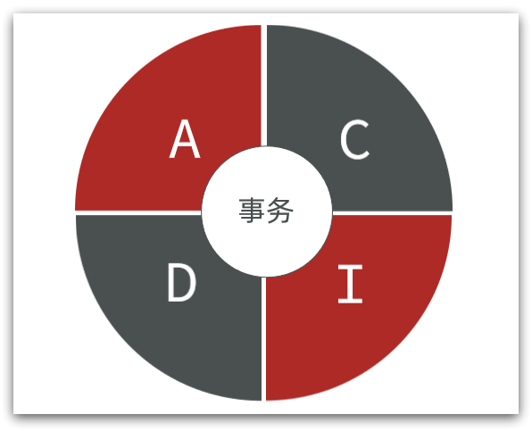

# Redis

## 一、基础

### 键值数据库（key-value）

### NoSQL 数据库

|          | SQL                                                          | NoSQL                                                        |
| -------- | ------------------------------------------------------------ | ------------------------------------------------------------ |
| 数据结构 | 结构化（Structured）                                         | 非结构化 1）键值类型·redis 2）文档类型·MongoDB 3）列类型·HBase 4）Graph类型·Neo4j |
| 数据关联 | 关联性（Relational）                                         | 无关联的                                                     |
| 查询方式 | SQL 查询                                                     | 非 SQL                                                       |
| 事务特性 | ACID                                                         | BASE                                                         |
| 存储方式 | 磁盘                                                         | 内存                                                         |
| 扩展性   | 垂直                                                         | 水平                                                         |
| 使用场景 | 1）数据结构固定 2）相关业务对数据安全性、一致性要求较高 | 1）数据结构不固定 2）对一致性、安全性要求不高 3）对性能要求较高 |

## Redis 安装

1. 图形化客户端：[Source code (zip) (github.com)](https://github.com/lework/RedisDesktopManager-Windows/archive/refs/tags/2022.5.zip)
2. 

