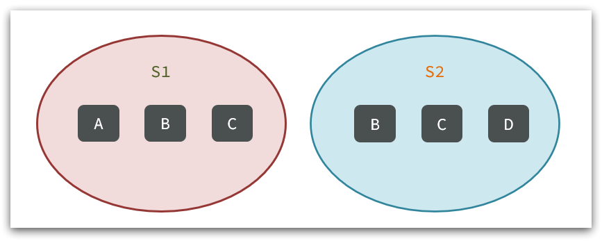
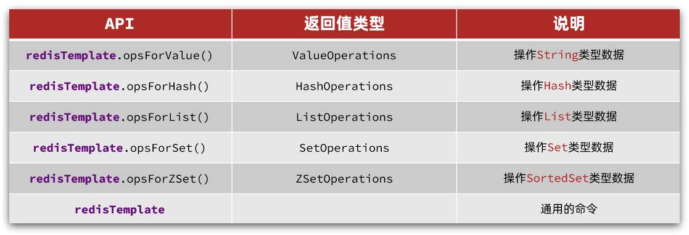

# Redis


## 一、基础

### （1）NoSQL 数据库

|          | SQL                                                          | NoSQL                                                        |
| -------- | ------------------------------------------------------------ | ------------------------------------------------------------ |
| 数据结构 | 结构化（Structured）                                         | 非结构化<br />1）键值类型·redis<br />2）文档类型·MongoDB<br />3）列类型·HBase<br />4）Graph类型·Neo4j |
| 数据关联 | 关联性（Relational）                                         | 无关联的                                                     |
| 查询方式 | SQL 查询                                                     | 非 SQL                                                       |
| 事务特性 | ACID                                                         | BASE                                                         |
| 存储方式 | 磁盘                                                         | 内存                                                         |
| 扩展性   | 垂直                                                         | 水平                                                         |
| 使用场景 | 1）数据结构固定<br />2）相关业务对数据安全性、一致性要求较高 | 1）数据结构不固定<br />2）对一致性、安全性要求不高<br />3）对性能要求较高 |

### （2）Redis

​	Redis 的全称是 Remote Dictionary Server，远程字典服务器，是一个基于内存的键值型 NoSQL 数据库。

#### 特征

- 键值型（key-value），value 支持多种不同数据结构，功能丰富；
- 单线程，每个命令具备原子性；
- 低延迟，速度快（基于内存、IO 多路复用、良好的编码）；
- 支持数据持久化；
- 支持主从集群、分片集群；
- 支持多语言客户端。

## 二、Redis 安装

1. [Redis 官方网站](https://redis.io/)
2. [图形化客户端源码](https://github.com/uglide/RedisDesktopManager)
3. [图形化客户端](https://github.com/lework/RedisDesktopManager-Windows/archive/refs/tags/2022.5.zip)
4. [C](https://download.visualstudio.microsoft.com/download/pr/b929b7fe-5c89-4553-9abe-6324631dcc3a/296F96CD102250636BCD23AB6E6CF70935337B1BBB3507FE8521D8D9CFAA932F/VC_redist.x64.exe)

## 三、Redis 基础

### （1）Redis 数据结构

​	Redis是典型的key-value数据库，key一般是字符串，而value包含很多不同的数据类型：


#### 常见用途

1. 字符串（String）：存储字符串或二进制数据，例如缓存、计数器等；
2. 列表（List）：有序字符串列表，常用于消息队列、最新列表等；
3. 集合（Set）：无序字符串集合，常用于标签、去重等；
4. 有序集合（Sorted Set）：有序的字符串集合，常用于排行榜、带权重的数据排序等；
5. 哈希表（Hash）：由字段和值组成的散列表，常用于存储对象、用户信息等；
6. BitMap：二进制位数组，可以进行位运算，支持按位统计、去重等操作。

### （2）Redis 通用命令

​	Redis 命令：[https://redis.io/commands ](https://redis.io/commands)

| 命令   | 说明                                               |
| ------ | -------------------------------------------------- |
| KEYS   | 查看符合模板的所有 key                             |
| DEL    | 删除一个指定的 key                                 |
| EXISTS | 判断key是否存在                                    |
| EXPIRE | 给一个key设置有效期，有效期到期时该key会被自动删除 |
| TTL    | 查看一个KEY的剩余有效期                            |

```sql
redis:2>SET name chen
"OK"
redis:2>KEYS *
1) "name"
redis:2>EXISTS name
"1"
redis:2>EXPIRE name 20
"1"
redis:2>TTL name
"15"
redis:2>TTL name
"6"
redis:2>DEL name
"1"
redis:2>KEYS *
redis:2>
```

### （3）String 类型

String类型，也就是字符串类型，是Redis中最简单的存储类型。

其value是字符串，不过根据字符串的格式不同，又可以分为3类：

- string：普通字符串
- int：整数类型，可以做自增、自减操作
- float：浮点类型，可以做自增、自减操作

不管是哪种格式，底层都是**字节数组**形式存储，只不过是**编码方式不同**。字符串类型的最大空间不能超过**512m**.


#### String 常用命令

- **SET**：添加或者修改已经存在的一个String类型的键值对
- **GET**：根据key获取String类型的value
- **M**SET：**批量**添加多个String类型的键值对
- MGET：根据多个key获取多个String类型的value
- **INCR**：让一个整型的key自增1
- INCRBY:让一个整型的key自增并指定步长，例如：incrby num 2 让num值自增2
- INCRBYFLOAT：让一个浮点类型的数字自增并指定步长
- **SETNX**：添加一个String类型的键值对，前提是这个key不存在，否则不执行
- **SETEX**：添加一个String类型的键值对，并且指定有效期

### （4）KEY 结构

Redis没有类似MySQL中的Table的概念，我们该如何区分不同类型的key呢？

```
项目名:业务名:类型:id
```

| **KEY**        | **VALUE**                                  |
| -------------- | ------------------------------------------ |
| mall:user:1    | {"id":1,  "name": "Jack", "age": 21}       |
| mall:product:1 | {"id":1,  "name": "小米11", "price": 4999} |

### （5）Hash 类型

Hash 类型，也叫散列，其 value 是一个无序字典，类似于 Java 中的 HashMap 结构。

String 结构是将对象序列化为 JSON 字符串后存储，当需要修改某个对象时很不方便：


Hash结构可以将对象中的每个字段独立存储，可以针对单个字段做CRUD：


#### Hash 常用命令

- HSET key field value：添加或者修改hash类型key的field的值

- HGET key field：获取一个hash类型key的field的值

- HMSET：批量添加多个hash类型key的field的值

- HMGET：批量获取多个hash类型key的field的值

- HGETALL：获取一个hash类型的key中的所有的field和value
- HKEYS：获取一个hash类型的key中的所有的field
- HINCRBY:让一个hash类型key的字段值自增并指定步长
- HSETNX：添加一个hash类型的key的field值，前提是这个**field**不存在，否则不执行

### （6）List 类型

Redis中的List类型与Java中的LinkedList类似，可以看做是一个双向链表结构。既可以支持正向检索和也可以支持反向检索。

特征也与LinkedList类似：

- 有序
- 元素可以重复
- 插入和删除快
- 查询速度一般

常用来存储一个有序数据，例如：**朋友圈点赞列表**，**评论列表**等。

#### List 常见命令

- LPUSH key element ... ：向列表左侧插入一个或多个元素
- LPOP key：移除并返回列表左侧的第一个元素，没有则返回nil
- RPUSH key element ... ：向列表右侧插入一个或多个元素
- RPOP key：移除并返回列表右侧的第一个元素
- LRANGE key star end：返回一段角标范围内的所有元素
- BLPOP和BRPOP：与LPOP和RPOP类似，只不过在没有元素时等待指定时间，而不是直接返回nil

### （7）Set类型

Redis的Set结构与Java中的HashSet类似，可以看做是一个value为null的HashMap。因为也是一个hash表，因此具备与HashSet类似的特征：

- 无序

- 元素不可重复

- 查找快

- 支持交集、并集、差集等功能

作用：获取共同好友。

#### Set 常见命令

- SADD key member ... ：向set中添加一个或多个元素
- SREM key member ... : 移除set中的指定元素
- SCARD key： 返回set中元素的个数
- SISMEMBER key member：判断一个元素是否存在于set中
- SMEMBERS：获取set中的所有元素
- SINTER key1 key2 ... ：求key1与key2的交集

例如两个集合：s1和s2:



求交集：SINTER s1 s2

求s1与s2的不同：SDIFF s1 s2


### （8）SortedSet类型

Redis的SortedSet是一个可排序的set集合，与Java中的TreeSet有些类似，但底层数据结构却差别很大。SortedSet中的每一个元素都带有一个**score**属性，可以基于score属性对元素排序，底层的实现是一个**跳表**（**SkipList**）加 **hash表**。

SortedSet具备下列特性：

- 可排序
- 元素不重复
- 查询速度快

因为SortedSet的可排序特性，经常被用来实现**排行榜**这样的功能。

#### SortedSet 常见命令

- ZADD key score member：添加一个或多个元素到sorted set ，如果已经存在则更新其score值
- ZREM key member：删除sorted set中的一个指定元素
- ZSCORE key member : 获取sorted set中的指定元素的score值
- ZRANK key member：获取sorted set 中的指定元素的排名
- ZCARD key：获取sorted set中的元素个数
- ZCOUNT key min max：统计score值在给定范围内的所有元素的个数
- ZINCRBY key increment member：让sorted set中的指定元素自增，步长为指定的increment值
- ZRANGE key min max：按照score排序后，获取指定排名范围内的元素
- ZRANGEBYSCORE key min max：按照score排序后，获取指定score范围内的元素
- ZDIFF、ZINTER、ZUNION：求差集、交集、并集

注意：所有的排名默认都是升序，如果要降序则在命令的Z后面添加REV即可，例如：

- **升序**获取sorted set 中的指定元素的排名：ZRANK key member

- **降序**获取sorted set 中的指定元素的排名：ZREVRANK key memeber

## 四、Redis 的 Java 客户端

在Redis官网中提供了各种语言的客户端，地址：https://redis.io/docs/clients/


标记为*的就是推荐使用的java客户端，包括：

- **Jedis**和**Lettuce**：这两个主要是提供了Redis命令对应的API，方便我们操作Redis，而SpringDataRedis又对这两种做了抽象和封装，因此我们后期会直接以SpringDataRedis来学习。
- **Redisson**：是在Redis基础上实现了分布式的可伸缩的java数据结构，例如Map、Queue等，而且支持跨进程的同步机制：Lock、Semaphore等待，比较适合用来实现特殊的功能需求。

### （1）Jedis

Jedis的官网地址： [https://github.com/redis/jedis](https://github.com/redis/jedis)

#### 快速入门

我们先来个快速入门：

1）引入依赖：

```xml
<!--jedis-->
<dependency>
    <groupId>redis.clients</groupId>
    <artifactId>jedis</artifactId>
    <version>3.7.0</version>
</dependency>
<!--单元测试-->
<dependency>
    <groupId>org.junit.jupiter</groupId>
    <artifactId>junit-jupiter</artifactId>
    <version>5.7.0</version>
    <scope>test</scope>
</dependency>
```

2）建立连接

新建一个单元测试类，内容如下：

```java
private Jedis jedis;

@BeforeEach
void setUp() {
    // 1.建立连接
    jedis = new Jedis("192.168.150.101", 6379);
    // 使用连接池获取 Jedis 实例
    // jedis = JedisConnectionFactory.getJedis();
    // 2.设置密码
    jedis.auth("123321");
    // 3.选择库
    jedis.select(0);
}
```

3）测试：

```java
@Test
void testString() {
    // 存入数据
    String result = jedis.set("name", "虎哥");
    System.out.println("result = " + result);
    // 获取数据
    String name = jedis.get("name");
    System.out.println("name = " + name);
}

@Test
void testHash() {
    // 插入hash数据
    jedis.hset("user:1", "name", "Jack");
    jedis.hset("user:1", "age", "21");

    // 获取
    Map<String, String> map = jedis.hgetAll("user:1");
    System.out.println(map);
}
```

4）释放资源

```java
@AfterEach
void tearDown() {
    if (jedis != null) {
        jedis.close();
    }
}
```

#### 连接池

**Jedis本身是线程不安全的，并且频繁的创建和销毁连接会有性能损耗**，因此我们推荐大家使用Jedis连接池代替Jedis的直连方式。

```java
package com.heima.jedis.util;

import redis.clients.jedis.*;

public class JedisConnectionFactory {

    private static JedisPool jedisPool;

    static {
        // 配置连接池
        JedisPoolConfig poolConfig = new JedisPoolConfig();
        poolConfig.setMaxTotal(8);
        poolConfig.setMaxIdle(8);
        poolConfig.setMinIdle(0);
        poolConfig.setMaxWaitMillis(1000);
        // 创建连接池对象，参数：连接池配置、服务端ip、服务端端口、超时时间、密码
        jedisPool = new JedisPool(poolConfig, "192.168.150.101", 6379, 1000, "123321");
    }

    public static Jedis getJedis(){
        return jedisPool.getResource();
    }
}
```

### （2）SpringDataRedis客户端

SpringData是Spring中数据操作的模块，包含对各种数据库的集成，其中对Redis的集成模块就叫做SpringDataRedis，官网地址：[https://spring.io/projects/spring-data-redis](https://spring.io/projects/spring-data-redis)

- 提供了对不同Redis客户端的整合（**Lettuce**和**Jedis**）
- 提供了RedisTemplate统一API来操作Redis
- 支持Redis的**发布订阅模型**
- 支持Redis**哨兵**和Redis集群
- 支持基于**Lettuce**的**响应式编程**
- 支持基于JDK、JSON、字符串、Spring对象的数据序列化及反序列化
- 支持基于Redis的JDKCollection实现

SpringDataRedis中提供了RedisTemplate工具类，其中封装了各种对Redis的操作。并且将不同数据类型的操作API封装到了不同的类型中：



#### 快速入门

SpringBoot已经提供了对SpringDataRedis的支持，使用非常简单。


首先，新建一个maven项目，然后按照下面步骤执行：

##### 1）引入依赖

```xml
<?xml version="1.0" encoding="UTF-8"?>
<project xmlns="http://maven.apache.org/POM/4.0.0" xmlns:xsi="http://www.w3.org/2001/XMLSchema-instance"
         xsi:schemaLocation="http://maven.apache.org/POM/4.0.0 https://maven.apache.org/xsd/maven-4.0.0.xsd">
    <modelVersion>4.0.0</modelVersion>
    <parent>
        <groupId>org.springframework.boot</groupId>
        <artifactId>spring-boot-starter-parent</artifactId>
        <version>2.5.7</version>
        <relativePath/> <!-- lookup parent from repository -->
    </parent>
    <groupId>com.heima</groupId>
    <artifactId>redis-demo</artifactId>
    <version>0.0.1-SNAPSHOT</version>
    <name>redis-demo</name>
    <description>Demo project for Spring Boot</description>
    <properties>
        <java.version>1.8</java.version>
    </properties>
    <dependencies>
        <!--redis依赖-->
        <dependency>
            <groupId>org.springframework.boot</groupId>
            <artifactId>spring-boot-starter-data-redis</artifactId>
        </dependency>
        <!--common-pool-->
        <dependency>
            <groupId>org.apache.commons</groupId>
            <artifactId>commons-pool2</artifactId>
        </dependency>
        <!--Jackson依赖-->
        <dependency>
            <groupId>com.fasterxml.jackson.core</groupId>
            <artifactId>jackson-databind</artifactId>
        </dependency>
        <dependency>
            <groupId>org.projectlombok</groupId>
            <artifactId>lombok</artifactId>
            <optional>true</optional>
        </dependency>
        <dependency>
            <groupId>org.springframework.boot</groupId>
            <artifactId>spring-boot-starter-test</artifactId>
            <scope>test</scope>
        </dependency>
    </dependencies>

    <build>
        <plugins>
            <plugin>
                <groupId>org.springframework.boot</groupId>
                <artifactId>spring-boot-maven-plugin</artifactId>
                <configuration>
                    <excludes>
                        <exclude>
                            <groupId>org.projectlombok</groupId>
                            <artifactId>lombok</artifactId>
                        </exclude>
                    </excludes>
                </configuration>
            </plugin>
        </plugins>
    </build>

</project>
```


##### 2）配置Redis

```yaml
spring:
  redis:
    host: 127.0.0.1
    port: 6379
    password: 1234
    lettuce:
      pool:
        max-active: 8
        max-idle: 8
        min-idle: 0
        max-wait: 100ms
```


##### 3）注入RedisTemplate

因为有了SpringBoot的自动装配，我们可以拿来就用：

```java
@SpringBootTest
class RedisStringTests {

    @Autowired
    private RedisTemplate redisTemplate;
}
```


##### 4）编写测试

```java
@SpringBootTest
class RedisStringTests {

    @Autowired
    private RedisTemplate edisTemplate;

    @Test
    void testString() {
        // 写入一条String数据
        redisTemplate.opsForValue().set("name", "虎哥");
        // 获取string数据
        Object name = stringRedisTemplate.opsForValue().get("name");
        System.out.println("name = " + name);
    }
}
```


#### 自定义序列化

RedisTemplate可以接收任意Object作为值写入Redis：


只不过写入前会把Object序列化为字节形式，默认是采用JDK序列化，得到的结果是这样的：


缺点：

- 可读性差
- 内存占用较大


我们可以自定义RedisTemplate的序列化方式，代码如下：

```java
@Configuration
public class RedisConfig {

    @Bean
    public RedisTemplate<String, Object> redisTemplate(RedisConnectionFactory connectionFactory){
        // 创建RedisTemplate对象
        RedisTemplate<String, Object> template = new RedisTemplate<>();
        // 设置连接工厂
        template.setConnectionFactory(connectionFactory);
        // 创建JSON序列化工具
        GenericJackson2JsonRedisSerializer jsonRedisSerializer = 
            							new GenericJackson2JsonRedisSerializer();
        // 设置Key的序列化
        template.setKeySerializer(RedisSerializer.string());
        template.setHashKeySerializer(RedisSerializer.string());
        // 设置Value的序列化
        template.setValueSerializer(jsonRedisSerializer);
        template.setHashValueSerializer(jsonRedisSerializer);
        // 返回
        return template;
    }
}
```


这里采用了JSON序列化来代替默认的JDK序列化方式。最终结果如图：


整体可读性有了很大提升，并且能将Java对象自动的序列化为JSON字符串，并且查询时能自动把JSON反序列化为Java对象。不过，其中记录了序列化时对应的class名称，目的是为了查询时实现自动反序列化。这会带来额外的内存开销。


### （3）StringRedisTemplate

为了节省内存空间，我们可以不使用JSON序列化器来处理value，而是**统一使用String序列化器**，要求**只能存储String类型的key和value**。当需要存储Java对象时，**手动完成对象的序列化和反序列化**。


因为存入和读取时的序列化及反序列化都是我们自己实现的，SpringDataRedis就不会将class信息写入Redis了。


这种用法比较普遍，因此SpringDataRedis就提供了RedisTemplate的子类：StringRedisTemplate，它的key和value的序列化方式默认就是String方式。


省去了我们自定义RedisTemplate的序列化方式的步骤，而是直接使用：

```java
@Autowired
private StringRedisTemplate stringRedisTemplate;
// JSON序列化工具
private static final ObjectMapper mapper = new ObjectMapper();

@Test
void testSaveUser() throws JsonProcessingException {
    // 创建对象
    User user = new User("虎哥", 21);
    // 手动序列化
    String json = mapper.writeValueAsString(user);
    // 写入数据
    stringRedisTemplate.opsForValue().set("user:200", json);

    // 获取数据
    String jsonUser = stringRedisTemplate.opsForValue().get("user:200");
    // 手动反序列化
    User user1 = mapper.readValue(jsonUser, User.class);
    System.out.println("user1 = " + user1);
}

```

## 五、登录


## 六、缓存

**缓存**就是数据交换的缓存区（Cache），是存储数据的临时地方，一般**读写性能较高**。


