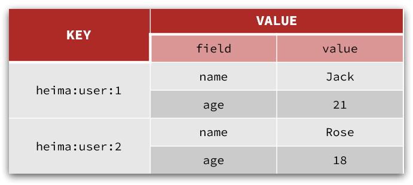

# Redis


## 一、基础

### （1）NoSQL 数据库

|          | SQL                                                          | NoSQL                                                        |
| -------- | ------------------------------------------------------------ | ------------------------------------------------------------ |
| 数据结构 | 结构化（Structured）                                         | 非结构化<br />1）键值类型·redis<br />2）文档类型·MongoDB<br />3）列类型·HBase<br />4）Graph类型·Neo4j |
| 数据关联 | 关联性（Relational）                                         | 无关联的                                                     |
| 查询方式 | SQL 查询                                                     | 非 SQL                                                       |
| 事务特性 | ACID                                                         | BASE                                                         |
| 存储方式 | 磁盘                                                         | 内存                                                         |
| 扩展性   | 垂直                                                         | 水平                                                         |
| 使用场景 | 1）数据结构固定<br />2）相关业务对数据安全性、一致性要求较高 | 1）数据结构不固定<br />2）对一致性、安全性要求不高<br />3）对性能要求较高 |

### （2）Redis

​	Redis 的全称是 Remote Dictionary Server，远程字典服务器，是一个基于内存的键值型 NoSQL 数据库。

#### 特征

- 键值型（key-value），value 支持多种不同数据结构，功能丰富；
- 单线程，每个命令具备原子性；
- 低延迟，速度快（基于内存、IO 多路复用、良好的编码）；
- 支持数据持久化；
- 支持主从集群、分片集群；
- 支持多语言客户端。

## 二、Redis 安装

1. Redis 官方网站：https://redis.io/
2. 图形化客户端源码：https://github.com/uglide/RedisDesktopManager
3. 图形化客户端：[Source code (zip) (github.com)](https://github.com/lework/RedisDesktopManager-Windows/archive/refs/tags/2022.5.zip)
4. C:https://download.visualstudio.microsoft.com/download/pr/b929b7fe-5c89-4553-9abe-6324631dcc3a/296F96CD102250636BCD23AB6E6CF70935337B1BBB3507FE8521D8D9CFAA932F/VC_redist.x64.exe

## 三、Redis 基础

### （1）Redis 数据结构

​	Redis是典型的key-value数据库，key一般是字符串，而value包含很多不同的数据类型：


### （2）Redis 通用命令

​	Redis 命令：[https://redis.io/commands ](https://redis.io/commands)

| 命令   | 说明                                               |
| ------ | -------------------------------------------------- |
| KEYS   | 查看符合模板的所有 key                             |
| DEL    | 删除一个指定的 key                                 |
| EXISTS | 判断key是否存在                                    |
| EXPIRE | 给一个key设置有效期，有效期到期时该key会被自动删除 |
| TTL    | 查看一个KEY的剩余有效期                            |

```sql
redis:2>SET name chen
"OK"
redis:2>KEYS *
1) "name"
redis:2>EXISTS name
"1"
redis:2>EXPIRE name 20
"1"
redis:2>TTL name
"15"
redis:2>TTL name
"6"
redis:2>DEL name
"1"
redis:2>KEYS *
redis:2>
```

### （3）String 类型

String类型，也就是字符串类型，是Redis中最简单的存储类型。

其value是字符串，不过根据字符串的格式不同，又可以分为3类：

- string：普通字符串
- int：整数类型，可以做自增、自减操作
- float：浮点类型，可以做自增、自减操作

不管是哪种格式，底层都是**字节数组**形式存储，只不过是**编码方式不同**。字符串类型的最大空间不能超过**512m**.


#### 3.1 String 常用命令

- **SET**：添加或者修改已经存在的一个String类型的键值对
- **GET**：根据key获取String类型的value
- **M**SET：**批量**添加多个String类型的键值对
- MGET：根据多个key获取多个String类型的value
- **INCR**：让一个整型的key自增1
- INCRBY:让一个整型的key自增并指定步长，例如：incrby num 2 让num值自增2
- INCRBYFLOAT：让一个浮点类型的数字自增并指定步长
- **SETNX**：添加一个String类型的键值对，前提是这个key不存在，否则不执行
- **SETEX**：添加一个String类型的键值对，并且指定有效期

### （4）KEY 结构

Redis没有类似MySQL中的Table的概念，我们该如何区分不同类型的key呢？

```
项目名:业务名:类型:id
```

| **KEY**        | **VALUE**                                  |
| -------------- | ------------------------------------------ |
| mall:user:1    | {"id":1,  "name": "Jack", "age": 21}       |
| mall:product:1 | {"id":1,  "name": "小米11", "price": 4999} |

### （5）Hash 类型

Hash 类型，也叫散列，其 value 是一个无序字典，类似于 Java 中的 HashMap 结构。

String 结构是将对象序列化为 JSON 字符串后存储，当需要修改某个对象时很不方便：


Hash结构可以将对象中的每个字段独立存储，可以针对单个字段做CRUD：


