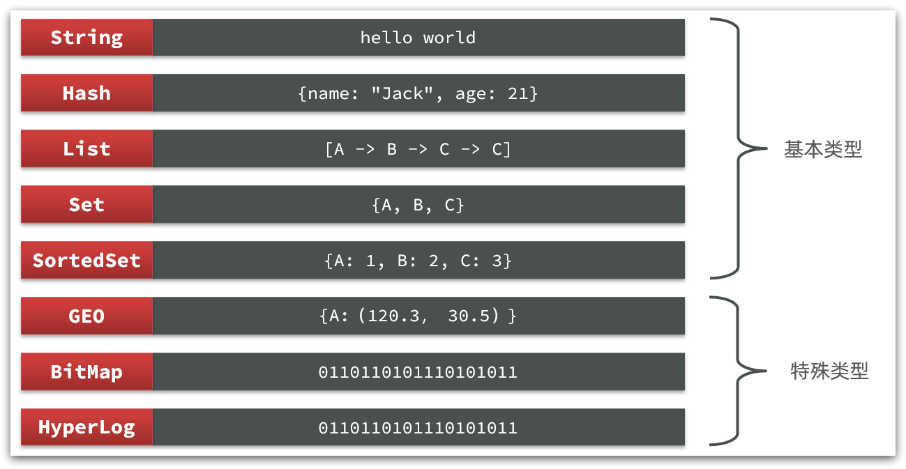

# Redis


## 一、基础

### （1）NoSQL 数据库

|          | SQL                                                          | NoSQL                                                        |
| -------- | ------------------------------------------------------------ | ------------------------------------------------------------ |
| 数据结构 | 结构化（Structured）                                         | 非结构化<br />1）键值类型·redis<br />2）文档类型·MongoDB<br />3）列类型·HBase<br />4）Graph类型·Neo4j |
| 数据关联 | 关联性（Relational）                                         | 无关联的                                                     |
| 查询方式 | SQL 查询                                                     | 非 SQL                                                       |
| 事务特性 | ACID                                                         | BASE                                                         |
| 存储方式 | 磁盘                                                         | 内存                                                         |
| 扩展性   | 垂直                                                         | 水平                                                         |
| 使用场景 | 1）数据结构固定<br />2）相关业务对数据安全性、一致性要求较高 | 1）数据结构不固定<br />2）对一致性、安全性要求不高<br />3）对性能要求较高 |

### （2）Redis

​	Redis 的全称是 Remote Dictionary Server，远程字典服务器，是一个基于内存的键值型 NoSQL 数据库。

#### 特征

- 键值型（key-value），value 支持多种不同数据结构，功能丰富；
- 单线程，每个命令具备原子性；
- 低延迟，速度快（基于内存、IO 多路复用、良好的编码）；
- 支持数据持久化；
- 支持主从集群、分片集群；
- 支持多语言客户端。

## 二、Redis 安装

1. Redis 官方网站：https://redis.io/
2. 图形化客户端源码：https://github.com/uglide/RedisDesktopManager
3. 图形化客户端：[Source code (zip) (github.com)](https://github.com/lework/RedisDesktopManager-Windows/archive/refs/tags/2022.5.zip)
4. C:https://download.visualstudio.microsoft.com/download/pr/b929b7fe-5c89-4553-9abe-6324631dcc3a/296F96CD102250636BCD23AB6E6CF70935337B1BBB3507FE8521D8D9CFAA932F/VC_redist.x64.exe

## 三、Redis 基础

### （1）Redis 数据结构

​	Redis是典型的key-value数据库，key一般是字符串，而value包含很多不同的数据类型：



### （2）Redis 通用命令

​	Redis 命令：[https://redis.io/commands ](https://redis.io/commands)

| 命令   | 说明                                               |
| ------ | -------------------------------------------------- |
| KEYS   | 查看符合模板的所有 key                             |
| DEL    | 删除一个指定的 key                                 |
| EXISTS | 判断key是否存在                                    |
| EXPIRE | 给一个key设置有效期，有效期到期时该key会被自动删除 |
| TTL    | 查看一个KEY的剩余有效期                            |

```sql
redis:2>SET name chen
"OK"
redis:2>KEYS *
1) "name"
redis:2>EXISTS name
"1"
redis:2>EXPIRE name 20
"1"
redis:2>TTL name
"15"
redis:2>TTL name
"6"
redis:2>DEL name
"1"
redis:2>KEYS *
redis:2>
```

### （3）String 类型

String类型，也就是字符串类型，是Redis中最简单的存储类型。

其value是字符串，不过根据字符串的格式不同，又可以分为3类：

- string：普通字符串
- int：整数类型，可以做自增、自减操作
- float：浮点类型，可以做自增、自减操作

不管是哪种格式，底层都是**字节数组**形式存储，只不过是**编码方式不同**。字符串类型的最大空间不能超过**512m**.


#### String 常用命令

- **SET**：添加或者修改已经存在的一个String类型的键值对
- **GET**：根据key获取String类型的value
- **M**SET：**批量**添加多个String类型的键值对
- MGET：根据多个key获取多个String类型的value
- **INCR**：让一个整型的key自增1
- INCRBY:让一个整型的key自增并指定步长，例如：incrby num 2 让num值自增2
- INCRBYFLOAT：让一个浮点类型的数字自增并指定步长
- **SETNX**：添加一个String类型的键值对，前提是这个key不存在，否则不执行
- **SETEX**：添加一个String类型的键值对，并且指定有效期

### （4）KEY 结构

Redis没有类似MySQL中的Table的概念，我们该如何区分不同类型的key呢？

```
项目名:业务名:类型:id
```

| **KEY**        | **VALUE**                                  |
| -------------- | ------------------------------------------ |
| mall:user:1    | {"id":1,  "name": "Jack", "age": 21}       |
| mall:product:1 | {"id":1,  "name": "小米11", "price": 4999} |

### （5）Hash 类型

Hash 类型，也叫散列，其 value 是一个无序字典，类似于 Java 中的 HashMap 结构。

String 结构是将对象序列化为 JSON 字符串后存储，当需要修改某个对象时很不方便：


Hash结构可以将对象中的每个字段独立存储，可以针对单个字段做CRUD：


#### Hash 常用命令

- HSET key field value：添加或者修改hash类型key的field的值

- HGET key field：获取一个hash类型key的field的值

- HMSET：批量添加多个hash类型key的field的值

- HMGET：批量获取多个hash类型key的field的值

- HGETALL：获取一个hash类型的key中的所有的field和value
- HKEYS：获取一个hash类型的key中的所有的field
- HINCRBY:让一个hash类型key的字段值自增并指定步长
- HSETNX：添加一个hash类型的key的field值，前提是这个**field**不存在，否则不执行

### （6）List 类型

Redis中的List类型与Java中的LinkedList类似，可以看做是一个双向链表结构。既可以支持正向检索和也可以支持反向检索。

特征也与LinkedList类似：

- 有序
- 元素可以重复
- 插入和删除快
- 查询速度一般

常用来存储一个有序数据，例如：**朋友圈点赞列表**，**评论列表**等。

#### List 常见命令

- LPUSH key element ... ：向列表左侧插入一个或多个元素
- LPOP key：移除并返回列表左侧的第一个元素，没有则返回nil
- RPUSH key element ... ：向列表右侧插入一个或多个元素
- RPOP key：移除并返回列表右侧的第一个元素
- LRANGE key star end：返回一段角标范围内的所有元素
- BLPOP和BRPOP：与LPOP和RPOP类似，只不过在没有元素时等待指定时间，而不是直接返回nil

### （7）Set类型

Redis的Set结构与Java中的HashSet类似，可以看做是一个value为null的HashMap。因为也是一个hash表，因此具备与HashSet类似的特征：

- 无序

- 元素不可重复

- 查找快

- 支持交集、并集、差集等功能

#### Set 常见命令

- SADD key member ... ：向set中添加一个或多个元素
- SREM key member ... : 移除set中的指定元素
- SCARD key： 返回set中元素的个数
- SISMEMBER key member：判断一个元素是否存在于set中
- SMEMBERS：获取set中的所有元素
- SINTER key1 key2 ... ：求key1与key2的交集

例如两个集合：s1和s2:


求交集：SINTER s1 s2

求s1与s2的不同：SDIFF s1 s2


练习：

1. 将下列数据用Redis的Set集合来存储：

- 张三的好友有：李四、王五、赵六
- 李四的好友有：王五、麻子、二狗

2. 利用Set的命令实现下列功能：

- 计算张三的好友有几人
- 计算张三和李四有哪些共同好友
- 查询哪些人是张三的好友却不是李四的好友
- 查询张三和李四的好友总共有哪些人
- 判断李四是否是张三的好友
- 判断张三是否是李四的好友
- 将李四从张三的好友列表中移除

### （8）SortedSet类型

Redis的SortedSet是一个可排序的set集合，与Java中的TreeSet有些类似，但底层数据结构却差别很大。SortedSet中的每一个元素都带有一个**score**属性，可以基于score属性对元素排序，底层的实现是一个**跳表**（**SkipList**）加 **hash表**。

SortedSet具备下列特性：

- 可排序
- 元素不重复
- 查询速度快

因为SortedSet的可排序特性，经常被用来实现**排行榜**这样的功能。

#### SortedSet 常见命令

- ZADD key score member：添加一个或多个元素到sorted set ，如果已经存在则更新其score值
- ZREM key member：删除sorted set中的一个指定元素
- ZSCORE key member : 获取sorted set中的指定元素的score值
- ZRANK key member：获取sorted set 中的指定元素的排名
- ZCARD key：获取sorted set中的元素个数
- ZCOUNT key min max：统计score值在给定范围内的所有元素的个数
- ZINCRBY key increment member：让sorted set中的指定元素自增，步长为指定的increment值
- ZRANGE key min max：按照score排序后，获取指定排名范围内的元素
- ZRANGEBYSCORE key min max：按照score排序后，获取指定score范围内的元素
- ZDIFF、ZINTER、ZUNION：求差集、交集、并集

注意：所有的排名默认都是升序，如果要降序则在命令的Z后面添加REV即可，例如：

- **升序**获取sorted set 中的指定元素的排名：ZRANK key member

- **降序**获取sorted set 中的指定元素的排名：ZREVRANK key memeber

练习题：

将班级的下列学生得分存入Redis的SortedSet中：

Jack 85, Lucy 89, Rose 82, Tom 95, Jerry 78, Amy 92, Miles 76

并实现下列功能：

- 删除Tom同学
- 获取Amy同学的分数
- 获取Rose同学的排名
- 查询80分以下有几个学生
- 给Amy同学加2分
- 查出成绩前3名的同学
- 查出成绩80分以下的所有同学
